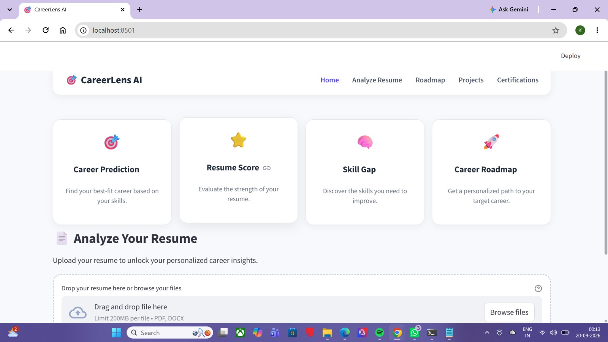
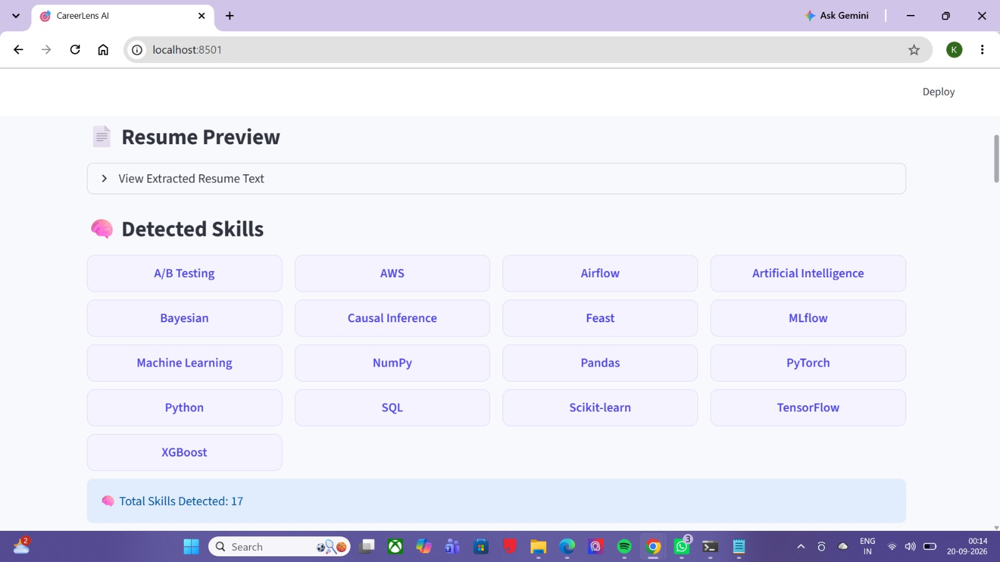
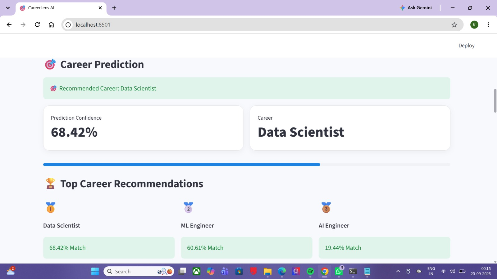
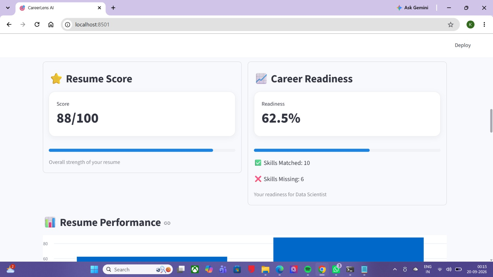
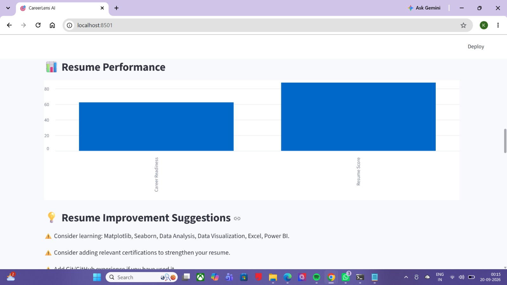
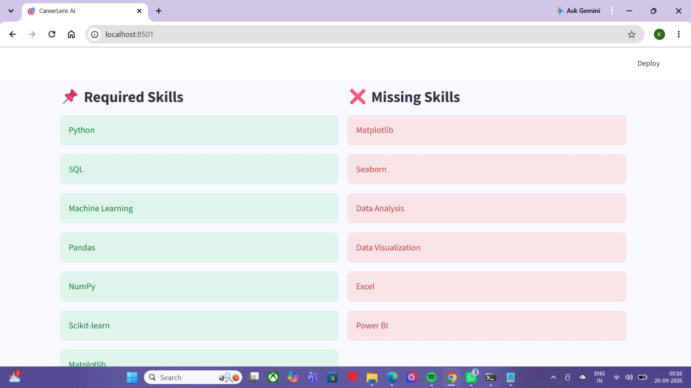
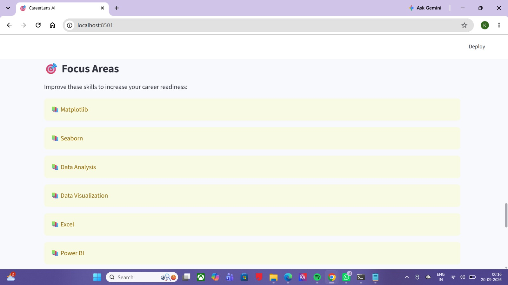
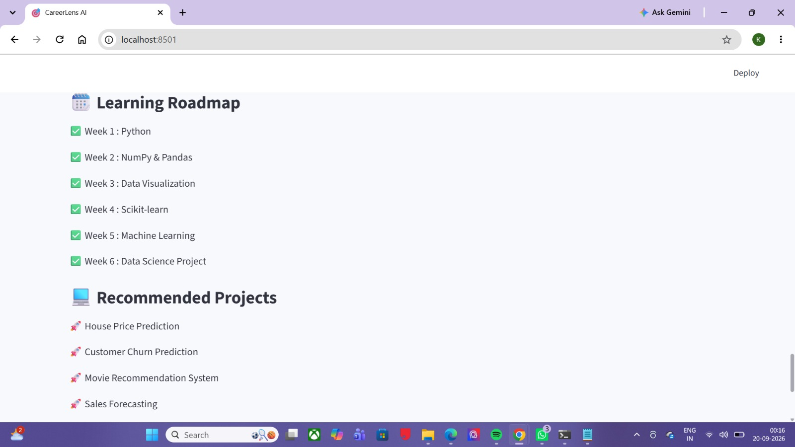
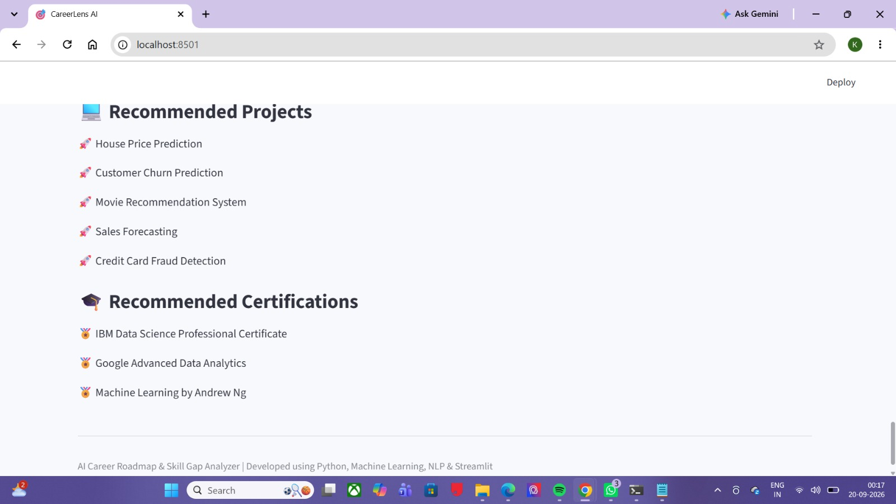

# 🎯 CareerLens AI — AI Career Roadmap & Skill Gap Analyzer

CareerLens AI is an AI/ML-powered web application that analyzes a user's resume and provides personalized career guidance.

It extracts skills from a resume, predicts suitable career paths, evaluates resume quality, identifies skill gaps, measures career readiness, and generates personalized learning resources.

---

## 🚀 Features

- 📄 Resume Upload — PDF & DOCX
- 📝 Resume Text Extraction
- 🧠 Automatic Skill Detection
- 🎯 AI-Based Career Prediction
- 🏆 Top Career Recommendations
- ⭐ Resume Score
- 📈 Career Readiness Score
- 📌 Required Skills Analysis
- ❌ Missing Skill Detection
- 💡 Resume Improvement Suggestions
- 🗓️ Personalized Learning Roadmap
- 💻 Recommended Projects
- 🎓 Recommended Certifications
- 📊 Resume Performance Visualization
- 🌐 Interactive Streamlit Dashboard

---

## 🔄 How It Works

Resume Upload
      ↓
Resume Text Extraction
      ↓
Skill Detection
      ↓
Career Prediction
      ↓
Resume Score + Career Readiness
      ↓
Skill Gap Analysis
      ↓
Improvement Suggestions
      ↓
Learning Roadmap
      ↓
Projects + Certifications

## 🛠️ Technologies Used

### Programming & Framework
-Python
-Streamlit
### Machine Learning & Data Science
-Scikit-learn
-Pandas
-NumPy
-Machine Learning
### NLP & Resume Processing
-NLP
-Keyword-Based Skill Extraction
-PyMuPDF
-Python-docx
### Development Tools
-Git
-GitHub
-VS Code
-Anaconda

## 📊 Key Outputs

CareerLens AI provides:

Analysis	Output
🎯 Career Prediction	Recommended career with confidence
🏆 Career Recommendations	Top matching career paths
⭐ Resume Score	Overall resume quality
📈 Career Readiness	Current readiness percentage
🧠 Skill Analysis	Detected skills
❌ Skill Gap	Missing skills
💡 Improvements	Resume improvement suggestions
🗓️ Roadmap	Personalized learning path
💻 Projects	Recommended projects
🎓 Certifications	Relevant certifications

## 📸 Application Screenshots

### 1. CareerLens AI Dashboard

### 2. Resume Upload & Skill Detection

### 3. Career Prediction & Recommendations

### 4. Resume Score & Career Readiness

### 5. Resume Performance & Improvement Suggestions

### 6. Required & Missing Skills

### 7. Career Focus Areas

### 8. Learning Roadmap & Recommended Projects

### 9. Projects & Certifications

## 📂 Project Structure
AI-Career-Analyzer/
│
├── app.py
├── career_predictor.py
├── resume_parser.py
├── skill_extractor.py
├── skill_gap.py
├── roadmap.py
├── recommendation.py
├── certifications.py
├── resume_score.py
├── readiness.py
├── improvements.py
├── style.css
│
├── datasets/
├── models/
├── sample_resumes/
├── screenshots/
│   ├── screenshot1.jpg
│   ├── screenshot2.jpg
│   ├── screenshot3.jpg
│   ├── screenshot4.jpg
│   ├── screenshot5.jpg
│   ├── screenshot6.jpg
│   ├── screenshot7.jpg
│   ├── screenshot8.jpg
│   └── screenshot9.jpg
│
├── tests/
├── requirements.txt
├── .gitignore
└── README.md

## ▶️ How to Run
1. Clone the Repository
git clone https://github.com/keerthanasenthil437-afk/AI-Career-Analyzer.git
2. Move into the Project Folder
cd AI-Career-Analyzer
3. Install Required Packages
pip install -r requirements.txt
4. Run the Application
streamlit run app.py

The application will open in your browser.

## 🎯 Example Analysis

For a sample Data Science resume, CareerLens AI can provide:

Recommended Career: Data Scientist
Prediction Confidence
Resume Score
Career Readiness
Detected Skills
Missing Skills
Learning Roadmap
Project Recommendations
Certification Recommendations

The results are generated based on the resume content and the application's career analysis logic.

## 🔮 Future Enhancements
🤖 LLM-based resume understanding
💬 AI Career Assistant
📊 Advanced resume analytics
🔗 Job recommendation system
📄 ATS compatibility analysis
🧠 Modern AI skill detection
🔍 Job description vs. resume comparison
📈 Personalized career progress tracking
👩‍💻 Developed By

Keerthana Senthilkumar

B.E. Computer Science Engineering
A.Velammal College of Engineering and Technology
Madurai, Tamil Nadu

## ⭐ Project

If you find this project useful, consider giving the repository a ⭐ on GitHub.